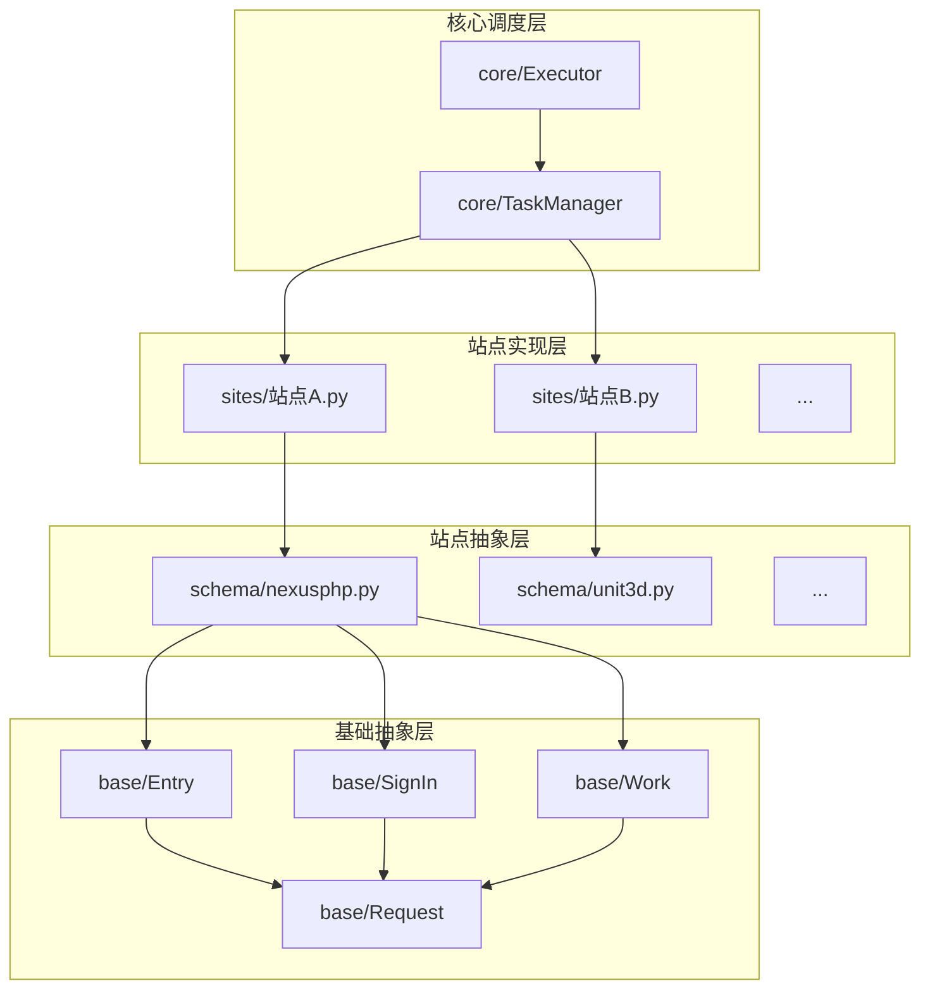

# PT-Checkin 项目模块化分析报告

## 1. 模块关系分析

本项目通过清晰的目录结构和分层设计，实现了一套相对完善的模块化架构。核心模块之间的关系如下：



*   **`base` (基础抽象层):** 这是整个架构的基石。它定义了与PT站点交互的最基础的抽象类，如 `Entry` (站点入口), `Request` (网络请求), `SignIn` (签到逻辑), 和 `Work` (其他任务，如获取数据)。这些类封装了最通用的行为和属性，所有上层模块都依赖于这些基础定义。

*   **`schema` (站点抽象层):** 这一层是模块化的关键。它根据不同PT站点的程序架构（如 NexusPHP, Unit3D）对 `base` 层进行了进一步的封装和实现。每个 `schema` 文件都继承自 `base` 中的类，并实现了特定站点架构的通用逻辑（如登录流程、签到页面的定位、数据解析方式等）。这使得 `sites` 层的实现可以变得非常简洁。

*   **`sites` (站点实现层):** 这是最具体的实现层。目录下的每一个文件都对应一个真实的PT站点。它们通过继承 `schema` 中对应的站点架构类，只需要配置该站点的特定信息（如URL、CSS选择器等），就可以快速适配一个新的站点。

*   **`core` (核心调度层):** `TaskManager` 负责从配置文件中加载所有启用的站点任务，并将其交给 `Executor`。`Executor` 则负责实际执行这些任务（登录、签到等），并管理整个流程的生命周期。这一层是整个应用的入口和指挥中心。

## 2. 模块化评估

### 优点

1.  **高内聚，低耦合:** 每一层的职责都非常清晰。`base` 负责通用抽象，`schema` 负责架构抽象，`sites` 负责具体实现，`core` 负责调度。层与层之间通过继承和接口调用进行交互，耦合度较低。
2.  **可扩展性强:** 添加一个新的PT站点变得非常容易。如果新站点属于已有的 `schema`，开发者只需要在 `sites` 目录下添加一个十几行代码的配置文件即可。即使是新的站点架构，也只需要在 `schema` 目录下增加一个新的实现，而不会影响到其他模块。
3.  **可维护性好:** 当某个站点架构的通用逻辑发生变化时（例如网站更新），只需要修改 `schema` 中对应的文件，所有继承自它的 `sites` 都会自动生效。同样，如果只是某个特定站点的签到规则变了，也只需要修改 `sites` 下对应的文件，不会影响其他站点。

### 缺点

1.  **`sites` 目录膨胀:** 随着支持的站点越来越多，`sites` 目录下的文件数量会急剧增加，可能会给查找和管理带来一些不便。
2.  **`schema` 的灵活性:** 当前的 `schema` 设计是基于继承的。如果某个站点在继承了某个 `schema` 的基础上，只有一两个签到步骤略有不同，就需要重写整个方法，可能会造成代码冗余。
3.  **通用逻辑的进一步抽象:** 在不同的 `schema` 之间，可能还存在一些可以被再次抽象的通用逻辑。例如，处理验证码、解析HTML的方式等，目前可能在多个 `schema` 中有重复的实现。

## 3. 优化建议

1.  **组织 `sites` 目录:**
    *   **建议:** 在 `sites` 目录下根据 `schema` 的类型创建子目录，将具体的站点实现归类存放。例如：
        ```
        sites/
        ├── nexusphp/
        │   ├── 52pt.py
        │   └── hdsky.py
        └── unit3d/
            └── m-team.py
        ```
    *   **理由:** 这样可以使 `sites` 目录的结构更加清晰，便于管理和查找。`TaskManager` 在加载时也需要相应地调整，以递归扫描子目录。

2.  **增强 `schema` 的灵活性 (组合优于继承):**
    *   **建议:** 考虑引入策略模式（Strategy Pattern）或类似的设计，将 `SignIn` 和 `Work` 的具体步骤拆分成更小的、可插拔的“策略”或“处理器”。例如，一个签到流程可以被看作是“访问首页 -> 点击签到按钮 -> 确认结果”等一系列步骤的组合。
    *   **理由:** 这样，当一个新站点的流程与现有 `schema` 大部分相似但略有不同时，我们不再需要重写整个方法，而只需要替换或重新组合其中的一两个步骤即可。这大大提高了代码的复用性和灵活性。

3.  **提取通用服务/工具:**
    *   **建议:** 创建一个 `services` 或 `helpers` 模块，将一些跨 `schema` 的通用功能（如验证码识别、HTML解析的特定辅助函数、通用的重试逻辑等）提取出来，作为独立的函数或类提供服务。
    *   **理由:** 减少在不同 `schema` 间的代码重复，提高代码质量和可维护性。

4.  **引入依赖注入 (Dependency Injection):**
    *   **建议:** 在 `core` 模块中，考虑使用依赖注入容器来管理 `TaskManager` 和 `Executor` 的创建和依赖关系。
    *   **理由:** 虽然当前项目的复杂度可能还不需要完整的DI框架，但引入这个概念可以使 `core` 模块的组件更加解耦，便于未来进行单元测试和功能扩展。

## 4. 总结

总的来说，该项目已经拥有一个非常出色和健壮的模块化架构。上述建议旨在现有基础上进行“锦上添花”式的优化，使其在面对更复杂的场景和更多站点支持时，依然能保持高度的可维护性和可扩展性。